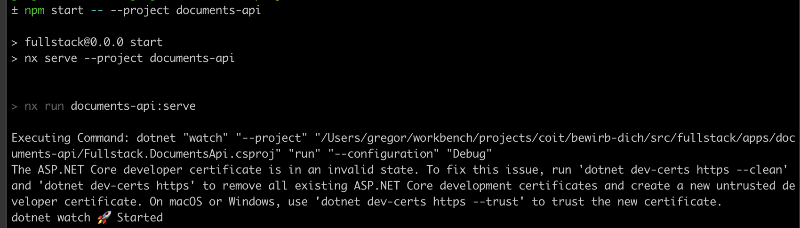
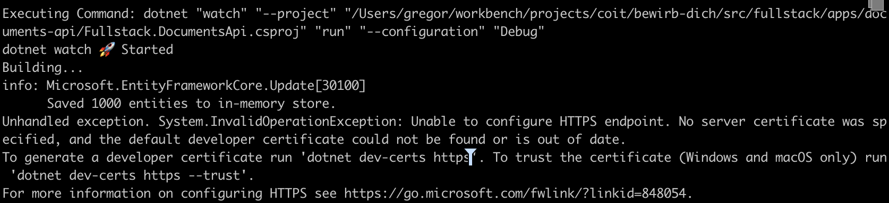

# Fullstack

## Bevor Du beginnst...

Bitte stell sicher, dass auf deinem System die folgenden Plattformen installiert sind.

- [.Net 7](https://dotnet.microsoft.com/en-us/download/dotnet/7.0)
- [Node LTS](https://nodejs.org/)

## Setup

### Das Projekt herunterladen und die Pakete installieren

Wir haben ein Repository, in dem wir alle Aufgaben für verschiedene Kandidaten
sammeln.
Für Dich haben wir eine Fullstack-Aufgabe.
Diese haben wir mit [Nx](https://nx.dev) aufgesetzt, damit der Code für
API und Client nahe beieinander liegen und sich komfortabel entwickeln lässt.

Das Projekt kannst du wie folgt laden und installieren.
Übrigens wird der Befehl `npm ci` auch die NuGet-Pakete installieren.

```bash
git clone https://github.com/co-IT/bewirb-dich.git
cd bewirb-dich/src/fullstack
npm ci
```

### .NET Web API starten

> Den Source Code findest Du unter apps/documents-api.

```bash
npx nx run documents-api:serve
## API erreichbar unter https://localhost:7157
```

### .NET Web API testen

> Den Source Code findest Du unter apps/documents-api-test.

```bash
npx nx run documents-api-test:test
```

Natürlich kannst du dieses Projekt auch direkt in Rider oder Visual Studio starten. 

### UI starten

> Den Source Code findest Du unter apps/documents.

```bash
npx nx run documents:serve
## Client erreichbar unter http://localhost:4200
```

### UI Tests Ausführen

> Den Source Code findest Du unter apps/documents-e2e.

```bash
npx nx run documents-e2e:e2e --watch
## Öffnet Cypress App
```

## Troubleshooting

Beim Start der Web API kann es passieren, dass sie mit einem Fehler abbricht,
wenn die Developer Zertifikate noch nicht installiert wurden oder abgelaufen sind.

Die Fehlermeldungen sehen wie folgt aus:




Wie in den Bildern zu sehen werden in den Fehlermeldungen auch Commandos genannt,
mit denen die Probleme behoben werden können

```bash
dotnet dev-certs https --clean
dotnet dev-certs https --trust
```
